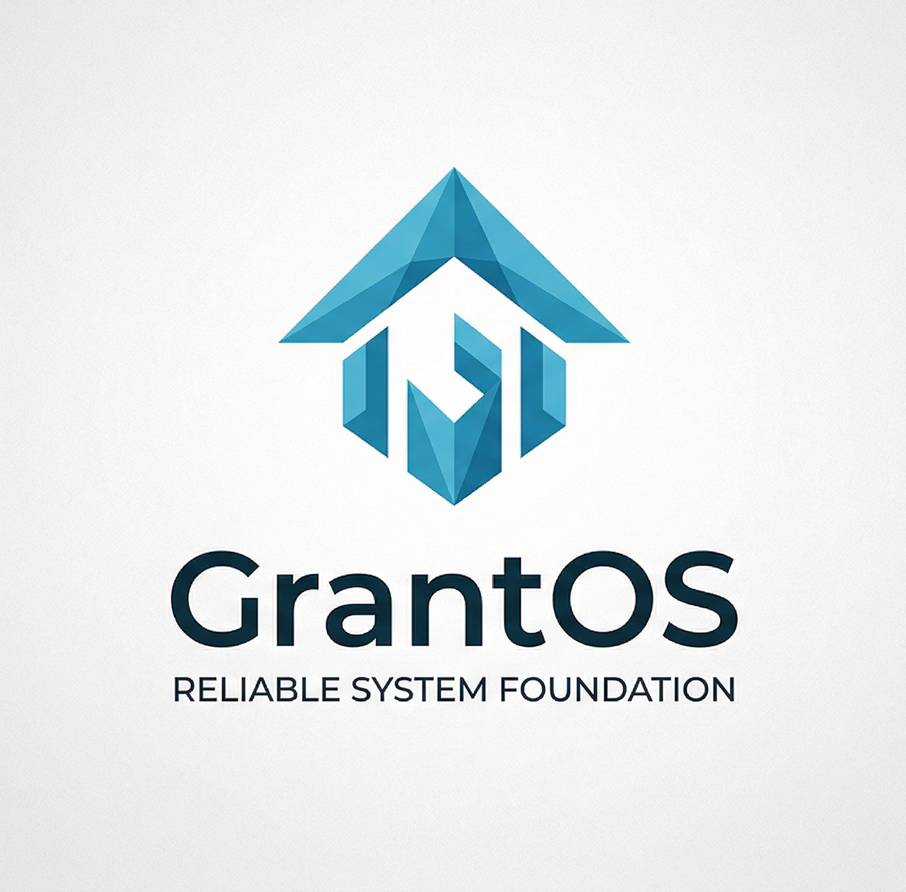

<div align="center">
  
  
  <h1>grantOS Operating System</h1>

  [](#)
  [](#)
  [](#)
</div>

grantOS is a custom, low-level operating system kernel designed specifically for the x86_64 architecture.

The core philosophy of grantOS is to provide a highly efficient, deterministic computational environment optimized for intense mathematical, physical, and applied science calculations. By operating at the bare-metal level and removing the overhead of traditional multi-purpose operating systems, grantOS aims to maximize throughput for complex scientific workloads.

A key design goal of grantOS is its parallel development with and optimization for the ClotLang programming language, aiming to serve as its native, bare-metal execution environment.

---

## Current Features

* **Architecture:** Base support for x86_64.
* **Memory Management:** Implementation of custom memory management algorithms.
* **Drivers:** Support for fundamental hardware drivers.
* **Interface:** System menu and integrated functions in text mode.
* **Isolated Environment:** Docker-based build environment to ensure reproducibility.

---

## Prerequisites

To compile and emulate grantOS, your host system must have the following tools installed:

1.  **Docker:** Required to generate and run the isolated build environment.
2.  **QEMU:** Emulator required to run the resulting kernel ISO image (`qemu-system-x86_64`).

---

## Project Structure

Below is the detailed organization of the main directories in the repository:

```text
grantOS/
├── .vscode/          # Development environment configuration (JSON settings).
├── build/            # Intermediate object files and binary artifacts.
├── buildenv/         # Docker container definition (Dockerfile) for the environment.
├── dist/             # Final resulting ISO image (`kernel.iso`).
│   └── x86_64/
├── docs/             # Additional project documentation.
├── makefiles/        # Additional Make scripts for the build process.
├── src/              # Main source code (C and Assembly).
├── targets/          # Specific configurations for different architectures.
│   └── x86_64/
├── Makefile          # Master build script.
└── kconfig.h         # Compile-time kernel configuration.
```

---

## Compilation and Build Process

grantOS development utilizes an isolated environment within a Docker container to prevent dependency conflicts on the host system.

### 1. Prepare the Build Environment

Before compiling for the first time, you must generate the Docker image containing the necessary build tools:

```bash
docker build buildenv -t myos-buildenv
```

### 2. Access the Build Environment

To compile the code, you must enter the Docker container by mounting the current directory as a volume:

**Linux / macOS / WSL2:**
```bash
docker run --rm -it -v "$(pwd)":/root/env myos-buildenv
```

**Windows (PowerShell):**
```powershell
docker run --rm -it -v "${pwd}:/root/env" myos-buildenv
```

> **Note for Docker Desktop users:** If you experience permission issues or unshared drives, ensure that Docker Desktop has access to the drive where the project is located in `Settings > Resources > File Sharing`.

### 3. Compile the Kernel (x86_64)

Once inside the Docker environment (at the `/root/env` terminal prompt), execute the following command to start the build process:

```bash
make build-x86_64
```

> **Note:** If QEMU is running, close it before compiling to prevent file access errors.

To leave the Docker environment once the compilation is finished, type `exit`.

---

## Emulation and Execution

Successful compilation will generate an ISO image at `dist/x86_64/kernel.iso`. You can emulate the operating system using QEMU.

Ensure that the QEMU binary is in your system's `PATH` environment variable. Execute the following command on your host system:

```bash
qemu-system-x86_64 -cdrom dist/x86_64/kernel.iso
```

> **Note:** Close the emulator when finished so as not to block writing to `kernel.iso` for future builds.

### Emulation Troubleshooting

If the above command fails, try specifying the path to the QEMU BIOS according to your operating system:

**Windows:**
```bash
qemu-system-x86_64 -cdrom dist/x86_64/kernel.iso -L "C:\Program Files\qemu"
```

**Linux:**
```bash
qemu-system-x86_64 -cdrom dist/x86_64/kernel.iso -L /usr/share/qemu/
```

---

## License and Authorship

**Author:** Julián Clot Córdoba ([jclot](https://github.com/jclot)).

This project is licensed under the MIT License. See the `LICENSE` file (if available) for details.
